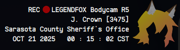

# Legendfox R5 Bodycam UI
A simple and customizable bodycam UI inspired by the Axon Body Cam™, made with AutoHotkey.

(Don't question why it's so late)

## Installation
First, install AutoHotkey v1.1 from https://www.autohotkey.com/. Then, download the files by clicking the green `<> Code ↓` button and then clicking the "Download ZIP" option. Unzip it in your directory of choice. Right-click `KlartextMonoBold.ttf` and hit the `Install` button to install the font to your device. Change the config (see below for how) and open `Bodycam.ahk`. You're done!

## Usage
Hit your clipping key to start the bodycam! Upon doing so, it'll hit the `MedalClippingKey` button (set in the config), start recording (with the `MedalRecordingButton`), play the Axon Body Cam™ "beep-beep" sound, and enable a flashing green "Recording" light. 
*P.S.: Since this doesn't play through your mic, you should make the beep sound with your mouth when you start the bodycam.*

Then, hit Ctrl+F1 to close it, and F12 to reset it (useful when moving the UI around in the config). 

Note: **This is intended to REPLACE your clipping and recording keys,** so please don't report any bugs that occur if you hit either while the bodycam is in "Record" mode. 

## Config
To change your bodycam settings, open `Config.ahk` in a standard text editor/IDE such as Notepad++ or VSCode. Follow the instructions in there and then simply open `Bodycam.ahk`.

## Requests & reporting
To report a bug or request a feature, please open an issue or a pull request using the tabs in the header.

## Supported platforms
This only supports devices running Windows and has only been tested on Windows 11 specifically. I do not intend to support other OSs or platforms. If you wish to add these features yourself, open a pull request.

### Disclaimers
The Sarasota County Sheriff's Office, both online groups and the "real one", have no relation to this project; the SCSO text is here solely for demonstrative purposes. To the best of my knowledge, the usage of the Klartext Mono font does not violate copyright law. Please open an issue if you wish to request a copyright-related removal of the font.
